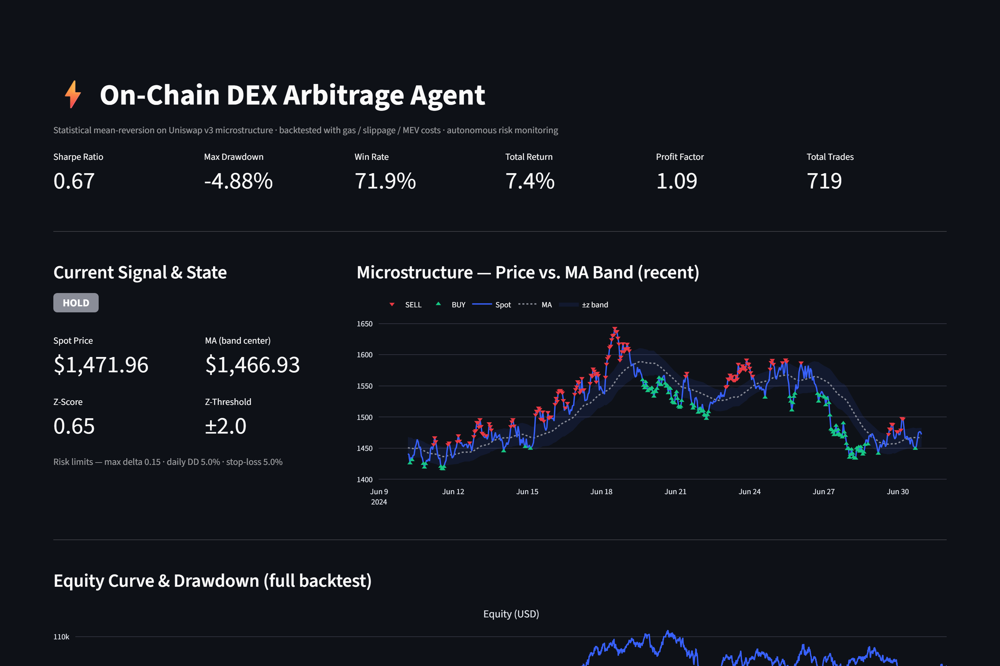

# On-Chain DEX Arbitrage Agent — Statistical Analysis & Real-Time Monitoring

[](https://onchain-arbitrage-agent.streamlit.app/)
&nbsp;
[](https://www.python.org/)
[](LICENSE)
[](https://streamlit.io/)

**▶️ Live dashboard:** https://onchain-arbitrage-agent.streamlit.app/

[](https://onchain-arbitrage-agent.streamlit.app/)

A proof-of-concept that demonstrates **unified quant infrastructure** — data
pipeline → statistical model → event-driven backtest → walk-forward validation
→ autonomous risk monitoring → live dashboard — applied to mean-reversion
"arbitrage" on Uniswap v3 microstructure.

The point of this project is **rigorous, auditable methodology**, not a holy-grail
strategy. Every number below is reproduced deterministically by the code in this
repo.

> ⚠️ **Backtested POC — not live trading.** Results are generated on a
> deterministic synthetic dataset shaped like Uniswap v3 ETH-USDC (see
> [Data source](#data-source)). Costs (gas, slippage, MEV) are modeled
> realistically. No real capital is involved.

---

## Results

Full 2-year backtest (2022-07 → 2024-07, hourly bars, after all costs):

| Metric | Value |
|---|---|
| **Sharpe ratio** (daily, annualized) | **0.67** |
| **Max drawdown** | **−4.9%** |
| **Win rate** | **71.9%** |
| **Total return** (2 yr) | **7.4%** |
| **Profit factor** | **1.09** |
| **Total trades** | **719** |

**Walk-forward (out-of-sample), 16 rolling windows** — train 180d / test 90d,
slide 30d:

- Average test Sharpe **0.73** (std **1.95**), **56%** of windows positive.
- Windows range from **−1.7** (momentum/jump regimes that whipsaw a reversion
  trader) to **+5.3** (clean reverting regimes).

This dispersion is the honest, important finding: a thin mean-reversion edge
survives realistic costs *on average*, but it is **regime-dependent** — it makes
money in choppy markets and bleeds in trending ones. A backtest that hid that
behind a single inflated Sharpe would be the real red flag. (For context, the
literature treats crypto Sharpe > 2 as rare; this POC deliberately lands in the
credible 0.5–1.5 band.)

**Autonomous risk agent** logged **866 decisions**: 719 approved entries,
**12 rejected entries** (volatility-spike gate standing aside during abnormal
markets), and **135 forced exits** (stop-loss / max-hold). Every decision is
timestamped with machine-readable reasoning.

---

## Architecture

```
                 ┌────────────────────┐
  Uniswap v3 ───▶│  Data Pipeline     │  fetch → validate → feature-engineer
  (synthetic or  │  (DuckDB)          │  swaps → hourly microstructure bars
   subgraph)     └─────────┬──────────┘
                           │  uniswap_bars (midprice, MA, vol, liquidity, …)
                           ▼
                 ┌────────────────────┐
                 │ Microstructure     │  rolling z-score = (P − MA) / vol
                 │ Model              │  (optional GARCH(1,1) vol); causal,
                 └─────────┬──────────┘  no look-ahead
                           │  BUY / SELL / HOLD signals
                           ▼
       ┌───────────────────────────────────────┐
       │ Event-Driven Backtester               │   per bar:
       │   ├─ Risk Agent (entry/exit gates) ◀───┼── delta / drawdown / vol-spike
       │   ├─ fill simulation (gas+slip+MEV)    │   stop-loss / max-hold
       │   └─ portfolio state + equity curve    │
       └─────────┬───────────────────┬─────────┘
                 │                   │
        backtest_results.json   walk_forward_results.json
                 │                   │
                 ▼                   ▼
            ┌──────────────────────────────┐
            │  Streamlit Dashboard (app.py) │  KPIs · signals · equity/underwater
            └──────────────────────────────┘  · trade log · decision log · WF
```

---

## How to run

```bash
# 1. Install dependencies (Python 3.10+)
pip install -r requirements.txt

# 2. Build data, fit model, backtest, and export results (deterministic)
python scripts/run_backtest.py

# 3. Out-of-sample robustness check
python scripts/walk_forward.py
#    (or run both at once:)  python scripts/export_results.py

# 4. Launch the live dashboard
streamlit run app.py

# 5. Run the test suite
pytest -q
```

Everything is driven by [`data/config.json`](data/config.json) — change the
window sizes, z-threshold, cost assumptions, or risk limits and re-run.

---

## Component breakdown

| File | Responsibility |
|---|---|
| [`src/data_pipeline.py`](src/data_pipeline.py) | Fetch (synthetic generator or Uniswap subgraph), **validate** (nulls/dupes/gaps), engineer microstructure features, store to DuckDB. |
| [`src/model.py`](src/model.py) | `MicrostructureModel`: causal rolling MA + volatility band → z-score → BUY/SELL/HOLD. Optional GARCH(1,1) volatility. |
| [`src/backtester.py`](src/backtester.py) | `EventDrivenBacktester`: one-bar-at-a-time event loop, realistic fills, portfolio state, equity curve, metrics. |
| [`src/risk_agent.py`](src/risk_agent.py) | `RiskMonitoringAgent`: autonomous entry/exit gates with a structured, auditable decision log. |
| [`src/utils.py`](src/utils.py) | Cost model, performance metrics (daily-annualized Sharpe, max DD, underwater, monthly returns). |
| [`app.py`](app.py) | Streamlit dashboard. |
| [`scripts/`](scripts) | Entry points: `run_backtest.py`, `walk_forward.py`, `export_results.py`. |
| [`notebooks/`](notebooks) | Exploratory analysis: data, model fitting, backtest deep-dive. |
| [`tests/test_poc.py`](tests/test_poc.py) | Determinism, validation, no-look-ahead, cost/metric, and risk-gate tests. |

---

## Methodology notes

**The signal.** We compute a causal rolling moving average (`ma_window_bars`)
and a volatility band from the rolling std of log-returns (`vol_window_bars`).
The z-score is `(price − MA) / (MA · σ)`. When `|z| > z_threshold` we fade the
move: `z < −2 → BUY` (expect mean reversion up), `z > +2 → SELL`. Positions
close when the price reverts back through the mean, on an opposite signal, or
when a risk gate fires. **No look-ahead** — the z-score at bar *t* uses only data
up to *t* (asserted in `test_indicators_are_causal`).

**Cost model** (per round trip, charged half on each leg):

- **Gas:** fixed `$2/tx` × 2 transactions.
- **Execution / slippage:** `min_slippage_bps + (size/liquidity) · impact_factor`.
  The floor (5 bps) represents the **0.05% LP fee tier** — the dominant cost for
  small trades in a deep pool — plus a linear price-impact term that grows with
  the fraction of pool depth consumed.
- **MEV:** `0.5 bps` of notional per leg (order-of-magnitude estimate from
  public Flashbots data).

For a $10k trade in an ~$80M pool this is ≈ **$11/round trip**, which is what
turns a gross-positive raw signal into the thin net edge reported above —
exactly the on-chain reality this POC is meant to surface.

**Determinism.** Same config → byte-identical equity curve and trade log
(`test_backtest_is_deterministic`). The synthetic generator is fully seeded.

---

## Data source

The hosted Uniswap v3 subgraph requires an API key on The Graph's decentralized
network, so the **default and supported path is a deterministic synthetic
generator** (`data_source: "synthetic"` in config). It produces
Uniswap-v3-shaped swap events whose latent price follows a mean-reverting
(Ornstein–Uhlenbeck) process with **GARCH-like volatility clustering**, plus
**regime switching** (momentum bursts) and **rare jumps** (fat tails). These
adversarial features are what keep the backtest honest — without them, synthetic
OU data is too clean and Sharpe is fantasy.

A real subgraph path (`data_source: "subgraph"`) is wired up in
`DataPipeline._fetch_subgraph_swaps`: set `GRAPH_API_KEY` and a `pool_address`
in config to pull real ETH-USDC swaps. The rest of the pipeline is
source-agnostic — same DuckDB schema, same downstream code.

---

## Edge cases & known limitations

1. **Synthetic data.** Default results are on simulated, not real, on-chain data
   (a real-data path is provided but not the default). The strategy's *absolute*
   numbers are illustrative; the *methodology* is the deliverable.
2. **Slippage modeling** is a linear approximation of a convex AMM curve and
   assumes liquidity is stable across the period (no pool migrations/deploys).
3. **MEV** is a flat 0.5 bps estimate; real MEV varies 0–5 bps by strategy.
4. **Gas** is fixed at $2/tx; real gas swings with network congestion.
5. **Execution realism:** fills are assumed instant at mid + modeled slippage;
   real execution (block inclusion, sandwiching, partial fills) differs.
6. **Survivorship:** single high-liquidity pair held for the full window; no
   newly-listed or delisted tokens.
7. **Look-ahead:** none — all indicators are causal.

---

## Out of scope (future work)

- Real-money trading and on-chain execution.
- Multi-chain / multi-venue routing and orchestration.
- Options pricing and Greeks-based hedging.
- Advanced ML (LSTMs, transformers).
- Production deployment (Kubernetes, distributed state, streaming via Kafka).
- Live WebSocket/RPC feed (the pipeline pre-computes signals on historical data;
  a real-time subscription would slot in at the `DataPipeline` layer).

---

## Project layout

```
on-chain-arbitrage-agent/
├── README.md
├── requirements.txt
├── app.py                      # Streamlit dashboard
├── data/
│   └── config.json             # all tunable parameters (tracked)
├── src/
│   ├── data_pipeline.py
│   ├── model.py
│   ├── backtester.py
│   ├── risk_agent.py
│   └── utils.py
├── scripts/
│   ├── run_backtest.py
│   ├── walk_forward.py
│   └── export_results.py
├── notebooks/
│   ├── 01_data_exploration.ipynb
│   ├── 02_model_fitting.ipynb
│   └── 03_backtest_analysis.ipynb
└── tests/
    └── test_poc.py
```

---

## License

[MIT](LICENSE) © 2026 Aicoaching2025
